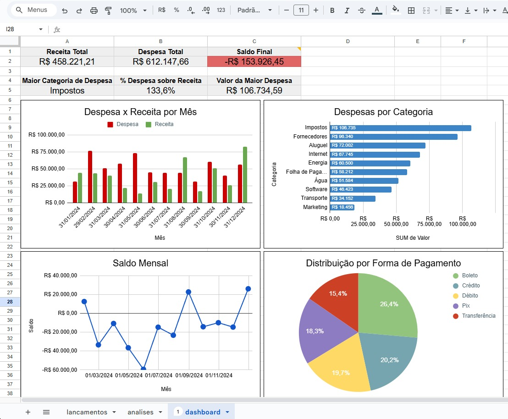

# 📊 Controle Financeiro Empresarial

Este projeto tem como objetivo demonstrar a construção de um controle financeiro empresarial utilizando Excel/Google Sheets, com foco em organização de dados, análise financeira e visualização por meio de dashboards.

## 🎯 Objetivos do Projeto
- Controlar receitas e despesas ao longo do tempo
- Analisar saldo mensal e resultado financeiro
- Identificar principais categorias de custo
- Avaliar distribuição por forma de pagamento

## 🧱 Estrutura do Projeto
- `lancamentos`: base de dados com registros financeiros fictícios
- `analises`: tabelas dinâmicas para consolidação dos dados
- `dashboard`: KPIs e gráficos para análise executiva

## 📌 KPIs Utilizados
- Receita Total
- Despesa Total
- Saldo Final
- % de Despesa sobre Receita
- Maior Categoria de Despesa
- Valor da Maior Despesa

## 📈 Visualizações
- Receita x Despesa por mês
- Saldo mensal
- Despesas por categoria
- Distribuição por forma de pagamento

Este dashboard foi criado seguindo boas práticas de visualização de dados — com KPIs no topo para foco em alto nível e gráficos que facilitam comparação, tendência e distribuição dos indicadores financeiros.

## 📌 Principais Insights
- O período apresentou prejuízo total de R$ 153.926,45.
- Impostos foi a maior categoria de despesa.
- Boleto foi a forma de pagamento mais utilizada em termos de valor.
- O saldo mensal variou negativamente na primeira metade do ano, com recuperação posterior.

## 🛠️ Ferramentas Utilizadas
- Google Sheets
- Tabelas dinâmicas
- Fórmulas financeiras
- Gráficos e dashboard

## 📷 Dashboard

## 📈 Como Utilizar

1. Abra a planilha em Google Sheets.
2. Ou acesse diretamente pelo link, pois a planilha pode apresentar erro de formatação: https://docs.google.com/spreadsheets/d/1sRkKmNU0VY_dGiO-bltNwx7yY265pC1a_QFyj52h09g/edit?usp=sharing
3. Revise a aba `analises` para entender as tabelas dinâmicas.
4. Confira os gráficos e KPIs na aba `dashboards`.
5. Faça comentários visuais para destacar insights importantes.

## 🧑‍💻 Autor
Eduardo Ribeiro  
Projeto desenvolvido para fins de portfólio e aprendizado em análise de dados.
